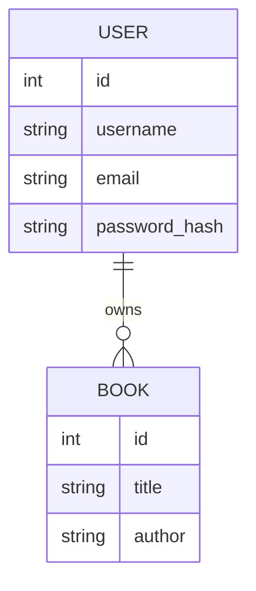

# Entity-Relationship Diagram (ERD)

This diagram shows the relationship between the `USER` and `BOOK` entities in the SimpleFlaskRESTfulBookLibrary application.

```mermaid
erDiagram
  USER {
    int id
    string username
    string email
    string password_hash
  }
  BOOK {
    int id
    string title
    string author
  }
  USER ||--o{ BOOK : owns
```